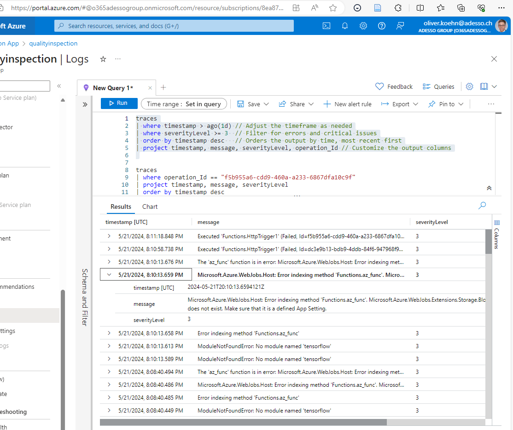

# Overview

Example for visual inspection.

# Setup

python3.11
install requirements

# Files

- **train_model.py**: run whole workbook to train network and save trained model. Might take some time.
- **use_model.py**: Use a pretrained model.
- **in/qualityInsepction.zip**: zip-file of all images.

# Azure functions

Fucntion is triggered when uplaoded to path. Improtant to use local file **local.settings.json** for debugging. Important to use key **AzureWebJobs**connectionVisualInspection and not just connectionVisualInspection.

```json
{
  "IsEncrypted": false,
  "Values": {
    "AzureWebJobsStorage": "***AccountName=rglobadvccdaib694***",
    "AzureWebJobsconnectionVisualInspection": "***AccountName=visualdetection***",
    "FUNCTIONS_WORKER_RUNTIME": "python",
    "AzureWebJobsFeatureFlags": "EnableWorkerIndexing",
    "44c30b_STORAGE": "UseDevelopmentStorage=true"
  }
}
```

# Logging
## Application Insights

```KQL
traces
| where timestamp > ago(1d) // Adjust the timeframe as needed
| where severityLevel >= 3  // Filter for errors and critical issues
| order by timestamp desc   // Orders the output by time, most recent first
| project timestamp, message, severityLevel, operation_Id // Customize the output columns
```

Logs


If fail with
```(Failed, Id=eefc8b9b-e29f-437a-adbc-1ca2eca864bb, Duration=23ms)```
then use
```KQL
traces
| where customDimensions.InvocationId == "eefc8b9b-e29f-437a-adbc-1ca2eca864bb"
```

Also possible to live monitor if right click in vscode on teh fucntion app. Will open new browser tab.
